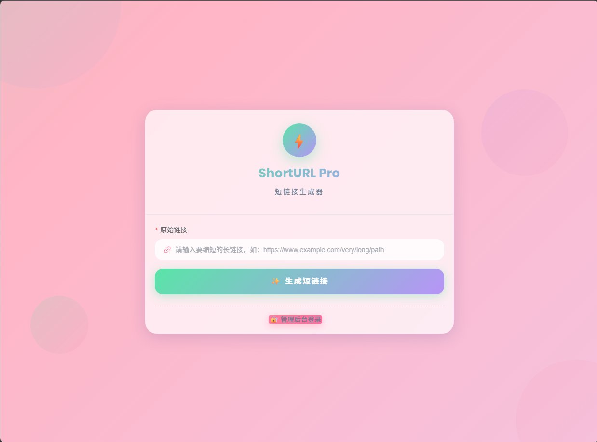
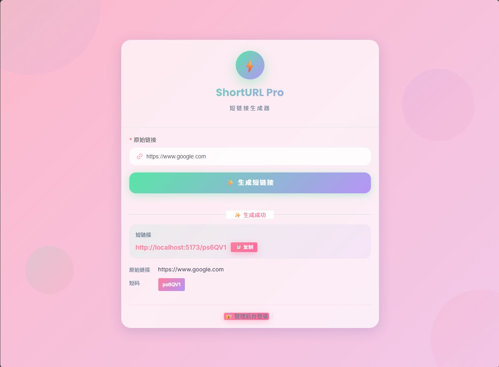
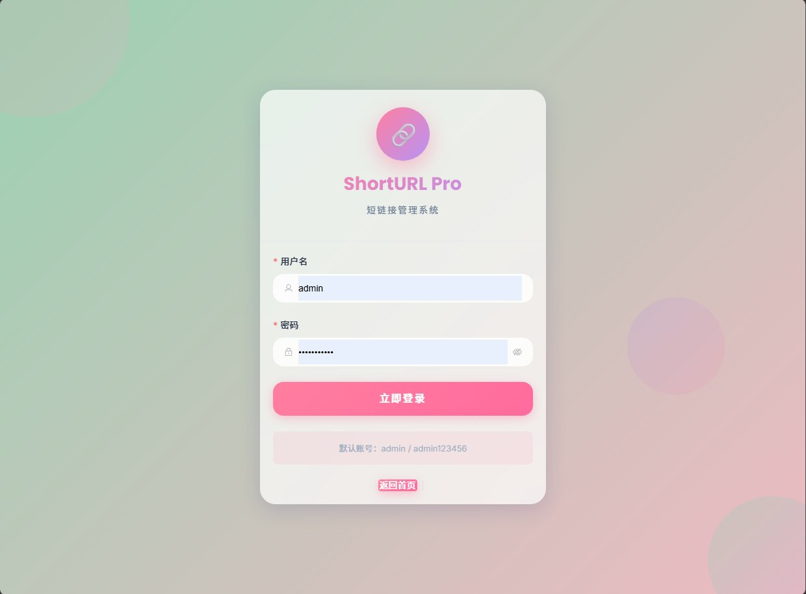
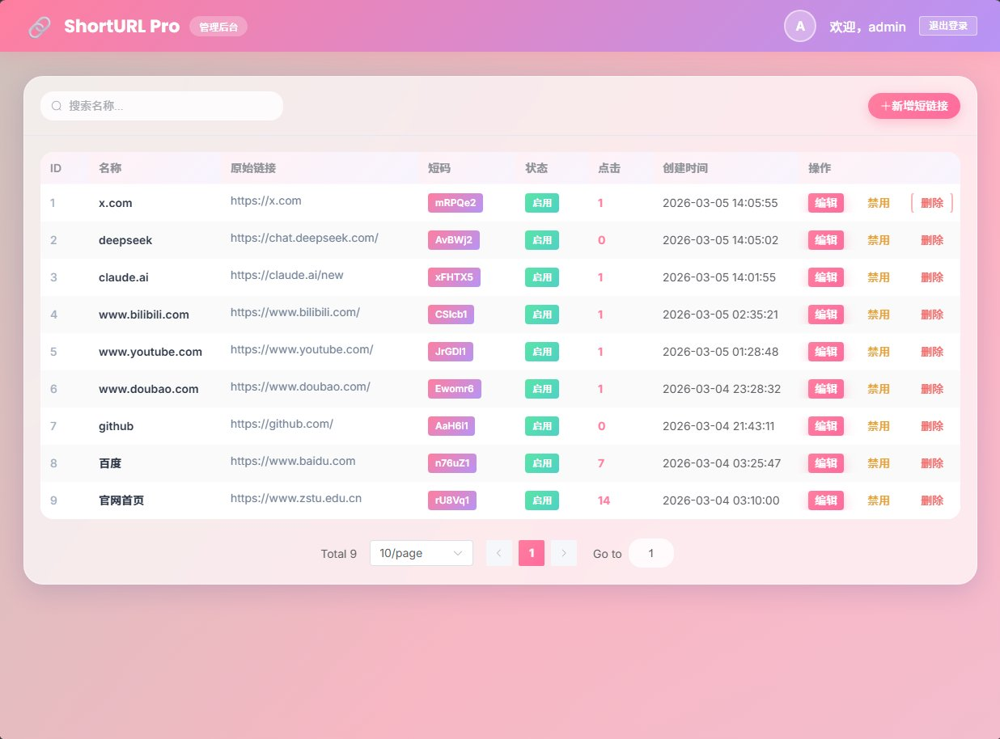

# ShortURL Pro

短链接管理系统

## 项目介绍

基于 Vue 3 + Spring Boot 的短链接管理平台，支持短链接生成、跳转管理、点击统计等功能。

## 页面预览

### 首页 - 短链接生成器



### 首页 - 生成结果



### 管理后台登录



### 管理后台 - 短链接列表



## 技术栈

### 前端
- Vue 3 + TypeScript
- Vite 5
- Pinia（状态管理）
- Element Plus（UI 组件库）
- Axios（HTTP 客户端）
- Mock.js（开发数据模拟）

### 后端
- Spring Boot 3
- MyBatis
- MySQL 8
- Redis + Spring Cache（缓存）
- JWT（认证）

## 项目结构

```
ShortUrlSystem/
├── backend/          # 后端项目
│   ├── src/
│   └── pom.xml
├── frontend/         # 前端项目
│   ├── src/
│   └── package.json
├── screenshots/                   # 页面截图
│   ├── home.png
│   ├── home-result.png
│   ├── login.png
│   └── admin.png
├── ShortURLPro接口文档v2.md    # 接口文档
└── README.md         # 本文件
```

## 快速开始

### 1. 环境要求

- JDK 17+
- Node.js 18+
- MySQL 8.0+
- Redis 6.0+
- Maven 3.6+

### 2. 后端启动

```bash
cd backend
./mvnw spring-boot:run
```

后端默认运行在 `http://localhost:8080`

### 3. 前端启动

```bash
cd frontend
npm install
npm run dev
```

前端默认运行在 `http://localhost:5173`

### 4. 默认账号

- 用户名：`admin`
- 密码：`admin123456`

## 功能特性

- 用户登录认证（JWT 双令牌）
- 短链接生成与管理
- 短链接跳转（前端页面跳转）
- 点击数统计（异步更新）
- Redis 缓存优化
- Swagger API 文档

## 接口文档

详见 [ShortURLPro接口文档v2.md](ShortURLPro接口文档v2.md)

## 许可证

本项目为浙江理工大学数字化共享生产实践课程作业。
